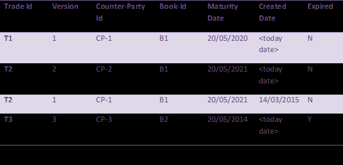

<H1>Trade App</H1>

There is a scenario where thousands of trades are flowing into one store, assume any way of transmission of trades. We need to create a one trade store, which stores the trade in the following order

There are couples of validation, we need to provide in the above assignment
1.	During transmission if the lower version is being received by the store it will reject the trade and throw an exception. If the version is same it will override the existing record.
2.	Store should not allow the trade which has less maturity date then today date.
3.	Store should automatically update the expire flag if in a store the trade crosses the maturity date.

<strong>FAQ&apos;s &nbsp;Can I use build management tool, is it mandatory?</strong>

Build management tool is not mandatory, but preference is that you should use any one of the build management tool (Gradle, Maven or Ant). This helps to build the code offline on interviewer&rsquo;s machine, without worrying about any dependencies.

<strong>How can I share the code with interviewer?</strong>

1. In case you are going through offline code pairing session (asynchronous) i.e. you get the assignment from resourcing team 2 days before, then preferred option is to commit the code in your <strong>GitHub</strong> repository. Make the repository public in read only mode and share it with resourcing team. Interviewer will offline asses the code and at the time of discussion with discuss with you.

2. In case you are coming to office premises for code pairing round (synchronous) , then interviewer will be sitting with you for code pairing session.

<strong>In case I am not able to solve the whole problem, will I be rejected?</strong>

There is no right or wrong answer, and we are not looking for 100% right solution or perfect design. We are here to assess the thought process, the design pattern you use in your code, how you think about the problem statement etc. The only condition is that whatever the code you are committing should be in working condition either it contains all the feature or not is not mandatory.

<strong>Can I use open source framework (spring-boot) etc.?</strong>

Yes, it&rsquo;s absolutely fine to use any open source framework, but please do ensure that with any framework you use proper build management tool (maven, Gradle) and it runs properly.

<strong>Do I really need to follow TDD?</strong>

The preferred option is to follow TDD. Your code should evolve with Red-Green-Refactor concept. In case you have not done TDD in past but writing test (JUnit) cases are mandatory. &nbsp;What-ever the code you are writing should be properly covered with the Unit Test Cases or Integration test cases. Interviewer will be first checking the test cases to review the code.

<strong>Can I use any database or cache in this assignment?</strong>

You are open to use any database or cache, but remember it&rsquo;s a test assignment not a project. Keeping technology stack simple will be helpful to build the code and will be self-explanatory.

<strong>Do I need to use CheckStyle&nbsp;or PMD in this assignment?</strong>

Absolutely your choice, there is no such preference. The code should be neat and self-documented with class names and method names.

&nbsp;

<strong>How long I need to spend with Interviewer for reviewing or pairing the code?</strong>

If it&rsquo;s an offline submission of the code Interviewer will <strong>spend 60 min to 90 min</strong> to review the code on phone or skype or any communication channel with the candidate

If its code pairing round Interviewer will be spending <strong>90 to 120 min</strong> with the candidate and will be cutting code together.

<h3>H2 Console</h3>
http://localhost:8080/h2-console

JDBC URL: jdbc:h2:mem:tradedb

<h3>Swagger</h3>
http://localhost:8080/swagger-ui.html

<h3>Sample Requests:</h3>
<pre>
{
"tradeId": "T1",
"version": "1",
"counterPartyId": "CP-1",
"bookId": "B1",
"maturityDate": "20/07/2022"
}
</pre>

<pre>
{
"tradeId": "T2",
"version": "1",
"counterPartyId": "CP-2",
"bookId": "B1",
"maturityDate": "20/07/2023"
}
</pre>

<pre>
{
"tradeId": "T2",
"version": "1",
"counterPartyId": "CP-1",
"bookId": "B1",
"maturityDate": "20/05/2021"
}
</pre>
